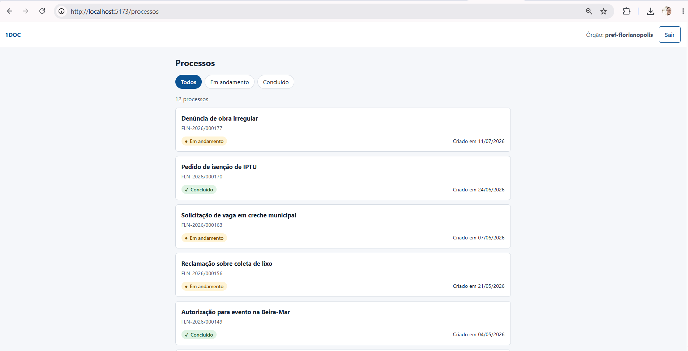
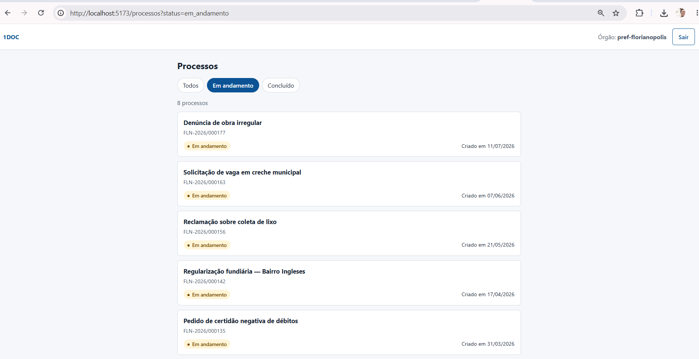
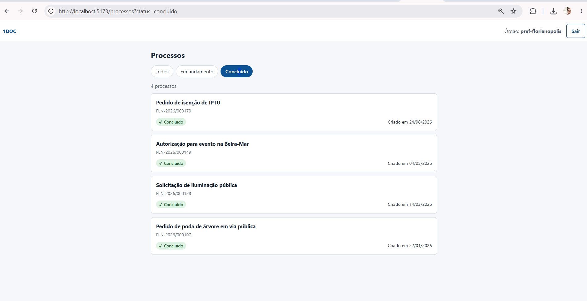

# softplan_web — 1DOC: consulta de processos

## 1. Objetivo

O **1DOC** é uma plataforma SaaS de gestão de documentos e trâmites usada por governos
municipais e estaduais. Uma nova camada de API
([softplan_api](https://github.com/andrecampero/softplan_api)) está substituindo aos poucos
o backend legado.

Esta é a **interface React para servidores públicos consultarem os processos** do seu
órgão. A tela faz login, lista os processos (título, status e data de criação) e filtra
por status, consumindo o contrato OpenAPI da nova API de ponta a ponta.

> Regras de arquitetura, estado, erros e acessibilidade estão no [CLAUDE.md](CLAUDE.md).

## 2. Escopo do teste técnico

Este repositório responde ao **Desafio 2 — Interface React** do teste técnico
(Engenheiro de Software Full Stack). A API do Desafio 1 está em
[softplan_api](https://github.com/andrecampero/softplan_api).

### O que o desafio pede e onde está

| Requisito do enunciado | Como foi atendido |
|---|---|
| Stack React + TypeScript | React 19 + TypeScript strict + Vite |
| Listagem consumindo `GET /processos` (ou mock com msw/array) | ✅ consome a **API real**; o MSW é usado nos testes |
| Exibir título, status e data de criação | ✅ `ProcessoCard` + `StatusBadge`, com data em pt-BR |
| Tratar os estados de loading, erro e lista vazia | ✅ `LoadingState`, `ErrorState` (mensagem amigável + ação) e `EmptyState` |
| Filtro por status (pelo menos Em andamento / Concluído) | ✅ `FilterBar` com Todos / Em andamento / Concluído; o filtro fica na URL e é aplicado pela API |
| Lógica em custom hook (`useProcessos`) | ✅ `src/features/processos/hooks/useProcessos.ts` |
| Pelo menos 2 componentes reutilizáveis | ✅ `ProcessoCard`, `StatusBadge`, `FilterBar` e `ProcessoList` |
| Gerenciamento de estado escolhido e justificado | ✅ TanStack Query para o estado vindo do servidor + URL para o filtro, sem store global; trade-offs na seção 11 do [CLAUDE.md](CLAUDE.md) |

### O que foi além do pedido

| Item | Motivo |
|---|---|
| Tela de login + sessão de 1 h | A API exige token; a sessão expira sozinha e volta ao login com aviso |
| Nada sigiloso no navegador | O token fica só em memória; o ESLint bloqueia `localStorage`/`sessionStorage` e um teste confirma que estão vazios |
| Sem requisições repetidas | Deduplicação, cache de 30 s, cancelamento ao trocar filtro, sem retry em 4xx/429; testes contam as requisições |
| Mensagens amigáveis para todo erro | Rede, 429 (com contagem regressiva), sessão expirada e erro interno (com código de suporte) |
| Acessibilidade | ESLint `jsx-a11y`, `aria-pressed` no filtro, `role="alert"` e `role="status"`, status com texto e ícone (não só cor) |
| Tipos gerados do contrato OpenAPI | Uma mudança na API quebra a compilação em vez de quebrar a tela |
| 49 testes, cobertura de linhas ~97% | Hooks, componentes, páginas, erros e sessão |
| **Git e CI/CD** | `.gitignore` (bloqueia `.env`, builds, PDFs, planilhas, imagens); **GitHub Actions** em `.github/workflows/ci.yml` roda lint (com acessibilidade), tipos, testes com cobertura mínima de 80% e build a cada push e Pull Request na `main` |

### Fora do escopo, de propósito

O enunciado não pede **upload de arquivos** nem **tela de detalhes do processo**, e diz que
"o objetivo não é terminar o sistema". Por isso a interface se limita à listagem com
filtro. Os dois caminhos estão planejados no [CLAUDE.md](CLAUDE.md): o detalhe segue o
passo a passo da seção 10 e o upload usaria URLs pré-assinadas do S3.

## 3. Stack

Node.js 22 (ver `.nvmrc`) · React 19 · TypeScript · Vite · TanStack Query · React Router ·
Vitest + Testing Library + MSW · ESLint (com `jsx-a11y`).

## 4. Pré-requisitos

- Node.js 22 e npm.
- **A API rodando** (`softplan_api`, `npm run dev` em http://localhost:3333).
- Não é preciso Docker.

## 5. Como subir

```bash
npm install
cp .env.example .env   # os valores padrão já apontam para a API local
npm run dev            # http://localhost:5173
```

| Variável | Para quê |
|---|---|
| `VITE_API_URL` | URL da API (padrão `http://localhost:3333`) |
| `VITE_TENANTS` | Órgãos exibidos no login, separados por vírgula |

Variáveis `VITE_*` vão para o bundle e são **públicas**: nunca coloque segredos nelas. A
interface não tem credencial própria; usa apenas o token obtido no login.

Para entrar, escolha o órgão e use o e-mail e a senha de um usuário mock. As senhas estão
no `.env` da API (veja o README da API, seção 8).

## 6. Como testar

```bash
npm test             # modo watch
npm run test:ci      # todos os testes + cobertura (igual ao CI)
npm run lint         # inclui acessibilidade e proibição de localStorage/sessionStorage
npm run typecheck
npm run build
```

Os testes não dependem da API: as respostas são simuladas com MSW (`src/mocks`).

Se o contrato da API mudar, regenere os tipos com a API ao lado (`../softplan_api`):

```bash
npm run api:types    # lê ../softplan_api/openapi.json e gera src/api/schema.d.ts
```

## 7. Estrutura de pastas

```
src/api/            cliente HTTP, tipos do contrato, catálogo de mensagens de erro, QueryClient
src/features/auth/      login, sessão (em memória) e rota protegida
src/features/processos/ useProcessos, StatusBadge, ProcessoCard, FilterBar, ProcessoList, página
src/shared/         estados de carregando/erro/vazio, ErrorBoundary, hooks
src/mocks/          handlers MSW usados nos testes
```

## 8. Decisões importantes

- **Estado:** a API é a fonte da verdade. O TanStack Query cuida do cache (30 s), da
  deduplicação e do cancelamento. O filtro fica na URL (`?status=`) e é aplicado pela API.
- **Segurança:** token e dados **somente em memória**, nunca em `localStorage`,
  `sessionStorage` ou cookie. Por isso, recarregar a página (F5) pede novo login. A sessão
  expira em 1 hora.
- **Erros:** toda falha vira uma mensagem amigável: rede, 429 com contagem regressiva,
  sessão expirada e erro interno com código de suporte.

## 9. Solução de problemas

| Sintoma | Causa / solução |
|---|---|
| Tela branca e erro `VITE_API_URL não configurada` no console | Crie o `.env` (`cp .env.example .env`) e reinicie o `npm run dev` |
| "Não foi possível conectar ao servidor" | A API não está rodando ou `VITE_API_URL` está errada |
| Erro de CORS no console do navegador | Adicione `http://localhost:5173` em `CORS_ORIGIN` no `.env` da API |
| "E-mail ou senha incorretos" com a senha certa | O órgão selecionado precisa ser o do usuário (cada órgão tem sua base) |
| "Muitas tentativas de login…" | Rate limit de 5 tentativas por minuto por conta: aguarde a contagem |
| Porta 5173 ocupada | Encerre o outro processo; a porta é fixa por causa do CORS |

## 10. Telas e evidências

Telas capturadas com a interface (`npm run dev`) consumindo a API real. As imagens ficam
em [`docs/imgs/`](docs/imgs), a única pasta do repositório onde imagens podem ser
versionadas.

### 1. Login
O servidor escolhe o órgão, informa e-mail e senha. O botão "Entrar" só fica ativo com os
campos preenchidos.


### 2. Login multitenant
O seletor mostra os órgãos (`pref-florianopolis`, `pref-joinville`, `gov-sc`). Cada órgão
tem sua própria base, e um usuário só entra no órgão ao qual pertence.


### 3. Lista de processos (todos)
Depois do login: título, número, status (com ícone e texto, não só cor) e data de criação
em pt-BR. O cabeçalho mostra o órgão logado e o botão "Sair".



### 4. Filtro "Em andamento"
O filtro vai para a URL (`?status=em_andamento`) e é aplicado pela API. O contador mostra
8 processos.



### 5. Filtro "Concluído"
`?status=concluido`, com 4 processos.


